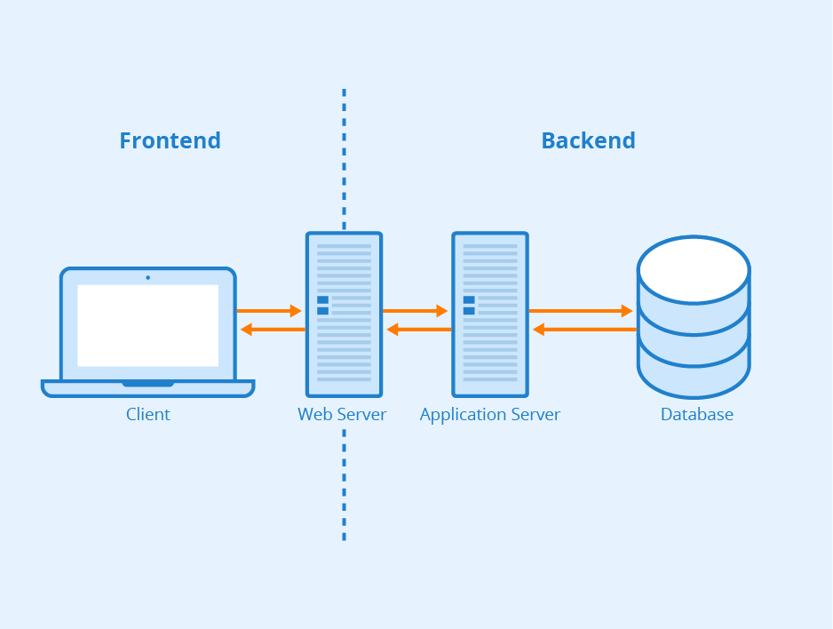

# M300-Services

# Plattformübergreifende Dienste in ein Netzwerk integrieren

#### Übersicht des Projekts

Eine Datenbank kann über ein Web-Frontend angesprochen werden mittels Admirer

#### Voraussetzungen

* MySQL Datenbankserver 
* Apache2 Webserver
* Clientmaschine zum ansprechen

### Inhaltsverzeichnis

* [10 Umgebung](10-Umgebung/)
* [20 Codebeschreib](20-Codebeschreib/)
* [30 Fazit](30-Fazit/)

### 10 Umgebung

Vagrant 2.2.19 und VirtualBox 6.1 Umgebung mit Hostonly- und NAT-Netzwerkschnittstellen auf einem Windows Host:

- Webserver: web-srv-01
 - Apache2 webserver
 - IP & Port 192.168.2.100:80
 - NAT 8080 (für den Client Zugriff)

- Datenbankserver: db-srv-01
 - MySQL DB
 - IP & Port 192.168.2.99:3306

### 20 Codebeschreib

